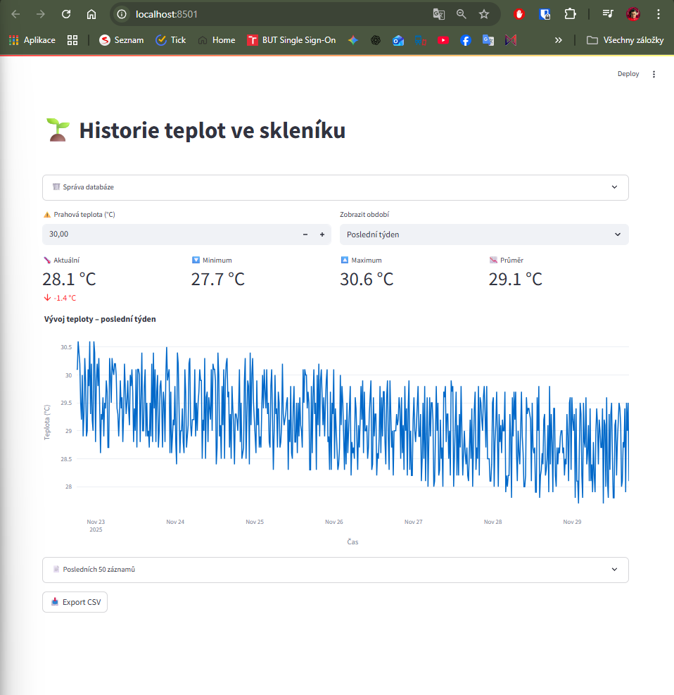

# 🌱 IoT Smart Greenhouse Monitor

**Komplexní systém pro vzdálené monitorování podmínek ve skleníku s využitím LoRa, ESP-NOW a MQTT.**

Tento projekt řeší klasický problém: *"Jak dostat data ze skleníku, který je daleko od domu a nemá dosah Wi-Fi, aniž bych musel každé dva dny měnit baterie v senzorech?"*




## 🚀 Jak to funguje (Architektura)

Systém využívá třívrstvou architekturu pro maximalizaci dosahu a minimalizaci spotřeby energie:

1.  **Senzorová vrstva (ESP32-C3 + ESP-NOW):**
    * Senzory uvnitř skleníku měří teplotu a vlhkost.
    * Využívají protokol **ESP-NOW** pro bleskový přenos dat a okamžitý přechod do hlubokého spánku (Deep Sleep). Díky tomu vydrží na baterie měsíce.
2.  **Přemostění (ESP32-S3 + LoRa):**
    * "Hub" umístěný ve skleníku (např. na střeše) přijímá data ze senzorů.
    * Okamžitě je přeposílá pomocí **LoRa (Long Range)** technologie směrem k domu. LoRa zajistí průchod signálu přes zdi a na stovky metrů.
3.  **Brána a Cloud (ESP32-S3 + MQTT):**
    * Přijímač v domě chytá LoRa signál, připojuje se k domácí Wi-Fi a publikuje data na **MQTT Broker** (např. Shiftr.io).
4.  **Vizualizace (Python + Streamlit):**
    * Serverová část (Python skript) ukládá data do SQLite databáze.
    * Webová aplikace (Streamlit) zobrazuje interaktivní grafy a statistiky.

---

## 🛠 Použitý Hardware

* **Senzor:** ESP32-C3 (nebo ESP8266) + DHT22 / BME280.
* **Hub (Skleník):** ESP32-S3 + LoRa modul (SX1278 / SX1262).
* **Gateway (Doma):** ESP32-S3 + LoRa modul.
* **Server:** Raspberry Pi / PC / Cloud pro běh Python skriptů.

---

## ⚙️ Konfigurace a Instalace

### 1. Firmware (ESP32)
Ve složce `/firmware_esp` naleznete tři různé kódy pro tři zařízení.
Před nahráním **musíte upravit konfigurační údaje** v souboru `Gateway.ino` a `database.py`:

```cpp
// PŘÍKLAD NASTAVENÍ V KÓDU (Gateway.ino)
const char* ssid = "VASE_WIFI_JMENO";
const char* password = "VASE_WIFI_HESLO";

// MQTT Nastavení (Zaregistrujte se např. na shiftr.io)
const char* mqtt_server = "public.cloud.shiftr.io";
const char* mqtt_user = "vase_jmeno";
const char* mqtt_pass = "vase_heslo_nebo_token";
```

### 2. Backend (Python Logger)

Tento skript musí běžet neustále na pozadí, aby sbíral data z MQTT.

### Nainstalujte závislosti:

```bash
pip install paho-mqtt
Upravte přihlašovací údaje v logger.py (stejné jako v ESP32).
```

Spusťte logger:
bash
Copy code
python logger.py
3. Frontend (Streamlit Dashboard)
Aplikace pro zobrazení dat.

Nainstalujte závislosti:
bash
Copy code
pip install streamlit pandas plotly streamlit-autorefresh
Spusťte aplikaci:
bash
Copy code
streamlit run app.py
📊 Ukázka Dashboardu
Aplikace poskytuje přehled o aktuální teplotě, min/max hodnotách a historii vývoje.

📁 Struktura projektu
bash
Copy code
/firmware      - Zdrojové kódy pro ESP32 (Arduino IDE / PlatformIO)
/src           - Python skripty (logger.py, app.py)
diagram.svg    - Schéma zapojení
teplota.db     - SQLite databáze (vytvoří se automaticky po spuštění)
⚠️ Disclaimer
Toto je hobby projekt. Ujistěte se, že vaše LoRa moduly vysílají na frekvenci povolené ve vaší zemi
(v EU typicky 868 MHz nebo 433 MHz).

Created by [Filip Častulík]